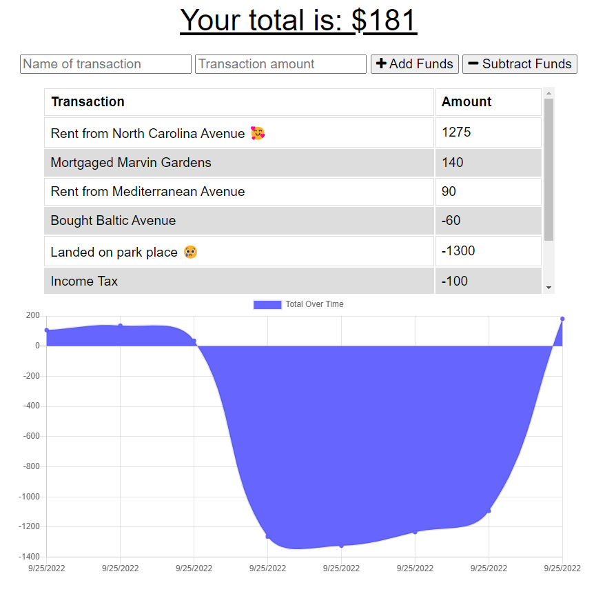

# Employee-Tracker


## About

Using the Google Books API, you can now search for the book you NEED. You're welcomeee!
## Table of Contents

* [Made-With](#Made-with)
* [Install](#Install)
* [Screenshots](#Screenshots)
* [Liscense](#Liscense)
* [Credits](#Contact)

## User Story

```
AS AN avid traveler
I WANT to be able to track my withdrawals and deposits with or without a data/internet connection
SO THAT my account balance is accurate when I am traveling
```

## Install

Once you have clone the repo, run ``` npm i ``` then ``` npm start ``` to run the program.

## Screenshots 



## Liscense

 This project is liscensed under the MIT liscense.
 
## Contact
Please email me at andrew@creativeaero.space if you have any questions